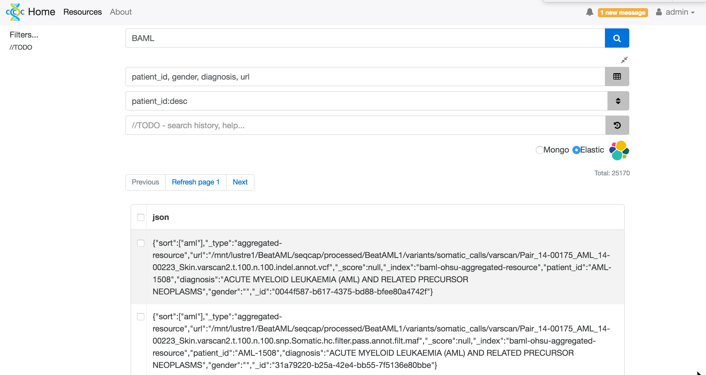

# YA-DMS UI

See [react-redux-starter-kit](http://cloudmu.github.io/react-redux-starter-kit/) for starter pack

Here's a screenshot:

## Technologies used:

- [React](https://github.com/facebook/react)
- [Redux](https://github.com/rackt/redux)
- [React Router](https://github.com/rackt/react-router)
- [Bootstrap](https://github.com/twbs/bootstrap)
- [JSON Web Token](https://jwt.io/)
- [Socket.IO](http://socket.io/)
- [create-react-app](https://github.com/facebookincubator/create-react-app/)
- [Babel](http://babeljs.io/) and [Webpack](http://webpack.github.io/) (now behind the scenes thanks to create-react-app)
